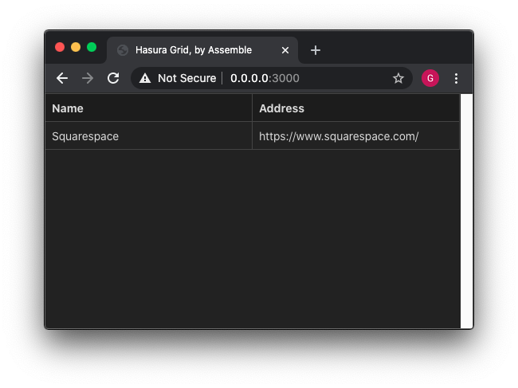

# Hierarch Grid

A [Hierarch engine](https://github.com/assembleapp/hierarch) cylinder.



Organize records using a common grid-based experience,  
such as you see in spreadsheet programs and relational databases.

Hierarch Grid speaks [GraphQL],  
backed by [Hasura] and [Postgres],  
and is inspired by [AirTable] and [FireTable].

[GraphQL]: https://graphql.org/
[Hasura]: https://hasura.io
[Postgres]: https://www.postgresql.org/
[AirTable]: https://airtable.com/
[FireTable]: https://firetable.io/

## Run on a local machine

```bash
git clone https://github.com/assembleapp/hierarch-grid.git
cd hierarch-grid
yarn
yarn start
```
